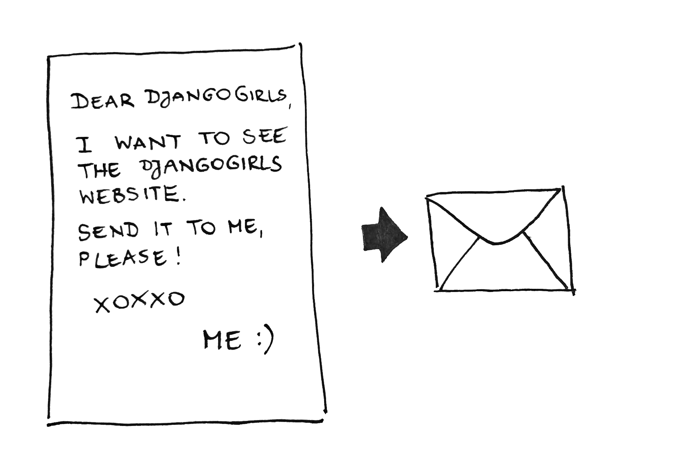

name: inverse
layout: true
class: center, middle, inverse
---
# Python and Web
---
## How web works?
---
class: center, middle, normalbg

.footnote[src: DjangoGirls]
---
class: center, middle, normalbg

.footnote[src: SubmarineCables]
---
class: center, middle, normalbg

.footnote[src: DjangoGirls]
---
class: center, middle, normalbg

.footnote[src: DjangoGirls]
---
## HTTP
---
layout: false

.left-column[
  ## What is it?
]
.right-column[
HTTP is an asymmetric request-response client-server protocol.  An HTTP client sends a request message to an HTTP server.  The server, in turn, returns a response message. 

- ** HTTP is a stateless protocol. **
- A HTTP connection includes request and response.
- Has a lot of status codes and methods.
]
---
.left-column[
  ## What is it?
  ## Request
]
.right-column[
## HTTP Request
<br />
```
>GET /docs/index.html HTTP/1.1
>Host: www.nowhere123.com
>Accept: image/gif, image/jpeg, */*
Accept-Language: en-us
Accept-Encoding: gzip, deflate
>User-Agent: Mozilla/4.0 (compatible; MSIE 6.0; Windows NT 5.1)
(blank line)
```
]
---
.left-column[
  ## What is it?
  ## Request
  ## Response
]
.right-column[
## HTTP Response
<br />
```
>HTTP/1.1 200 OK
Date: Sun, 18 Oct 2009 08:56:53 GMT
Server: Apache/2.2.14 (Win32)
Last-Modified: Sat, 20 Nov 2004 07:16:26 GMT
ETag: "10000000565a5-2c-3e94b66c2e680"
Accept-Ranges: bytes
Content-Length: 44
Connection: close
>Content-Type: text/html
X-Pad: avoid browser bug
(blank line)  
><html><body><h1>It works!</h1></body></html>

```
]
---
### @bugraisguzar
### github/bisguzar
### ben@bisguzar.com
