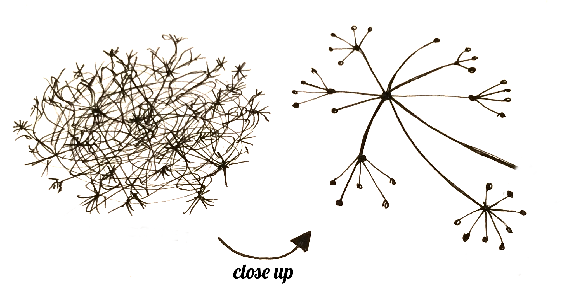
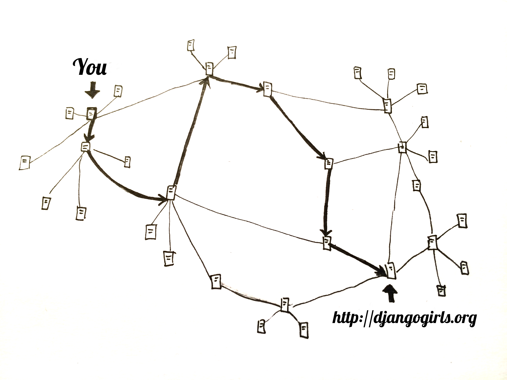
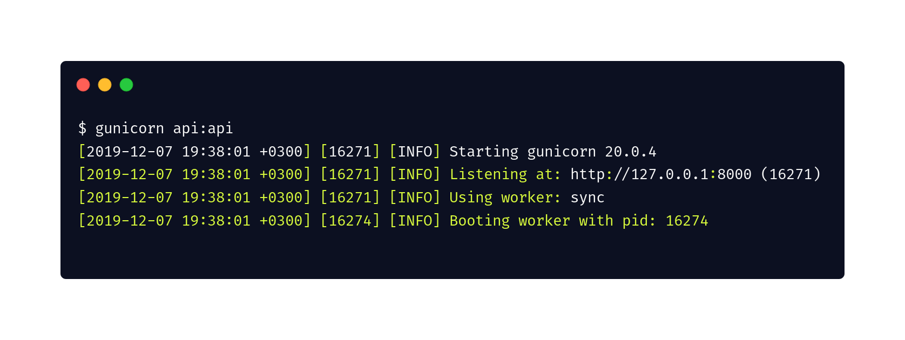

name: inverse
layout: true
class: center, middle, inverse
---
# Python and Web
---
class: center, middle, inverse

.mine-picture[
  
]

### @bugraisguzar
### github.com/bisguzar
### ben@bisguzar.com
### www.bisguzar.com
---
## How web works?
---
class: center, middle, normalbg

.footnote[src: DjangoGirls]
---
class: center, middle, normalbg

.footnote[src: SubmarineCables]
---
class: center, middle, normalbg

.footnote[src: DjangoGirls]
---
class: center, middle, normalbg

.footnote[src: DjangoGirls]
---
## HTTP
---
layout: false

.left-column[
  ## What is it?
]
.right-column[
HTTP is an asymmetric request-response client-server protocol.  An HTTP client sends a request message to an HTTP server.  The server, in turn, returns a response message. 

- ** HTTP is a stateless protocol. **
- A HTTP connection includes request and response.
- Has a lot of status codes and methods.
]
---
.left-column[
  ## What is it?
  ### Request
]
.right-column[
## HTTP Request
<br />
```
>GET /docs/index.html HTTP/1.1
>Host: www.nowhere123.com
>Accept: image/gif, image/jpeg, */*
Accept-Language: en-us
Accept-Encoding: gzip, deflate
>User-Agent: Mozilla/4.0 (compatible; MSIE 6.0; Windows NT 5.1)
(blank line)
```
]
---
.left-column[
  ## What is it?
  ### Request
  ### Response
]
.right-column[
## HTTP Response
<br />
```
>HTTP/1.1 200 OK
Date: Sun, 18 Oct 2009 08:56:53 GMT
Server: Apache/2.2.14 (Win32)
Last-Modified: Sat, 20 Nov 2004 07:16:26 GMT
ETag: "10000000565a5-2c-3e94b66c2e680"
Accept-Ranges: bytes
Content-Length: 44
Connection: close
>Content-Type: text/html
X-Pad: avoid browser bug
(blank line)  
><html><body><h1>It works!</h1></body></html>

```
]
---
.left-column[
  ## What is it?
  ### Request
  ### Response
  ### Status Codes
]
.right-column[
## Status Codes

** 1xx Informational **

** 2xx Successful **
* 200 Ok
* 201 Created

** 3xx Multiple Choice **
* 301 Moved Permanently

** 4xx Client Error **
* 404 Not Found
* 405 Method Not Allowed

** 5xx Server Error **
* 500 Internal Server Error
]
---
.left-column[
  ## What is it?
  ### Request
  ### Response
  ### Status Codes
  ### Methods 1/3
]
.right-column[
## GET

The GET method is used to retrieve information from the given server using a given URI. 

.KIM[
  Requests using GET should only retrieve data and should have no other effect on the data.
]

]
---
.left-column[
  ## What is it?
  ### Request
  ### Response
  ### Status Codes
  ### Methods 2/3
]
.right-column[
## POST

A POST request is used to send data to the server, for example, customer information, file upload, etc. using HTML forms.

]
---
.left-column[
  ## What is it?
  ### Request
  ### Response
  ### Status Codes
  ### Methods 3/3
]
.right-column[
## PUT

Replaces all current representations of the target resource with the uploaded content.


## DELETE

Removes all current representations of the target resource given by a URI.
]
---
class: middle
# Web Architectures

###  MVC/MVT
Render on server, return full content to client

###  SPAs
Just return required, asked content from server, render on client
---
class: center, middle, inverse
# Talk is Cheap Show Me Something
---
class: center, middle, inverse
# first at all, ads...
---
class: middle

#  Rulepipe

The rule engine you always deserved.

RulePipe is a declarative, scalable, highly configurable rule engine. Usage areas include, but not limited to;

*  Classification
*  Filtering
*  Triggering other tasks
*  User-driven flow implementations
*  Event based checks
*  Domain specific complex rule inputs

---
Initialize structure

```python
import falcon
from rulepipe import RuleManager

try:
  import ujson as json
except ModuleNotFoundError:
  import json

rulemanager = RuleManager()

api = falcon.API()
```

---
Create main resource

```python
import falcon
from rulepipe import RuleManager

try:
  import ujson as json
except ModuleNotFoundError:
  import json

rulemanager = RuleManager()

> class MainResource(object):
>   def on_get(self, req, resp):
>     resp.content_type = falcon.MEDIA_TEXT
>     resp.body = 'Rulepipe is alive!'

api = falcon.API()
> api.add_route('/', MainResource())
```

---
Create ** Add Rule ** endpoint

```python
...
rulemanager = RuleManager()


class MainResource(object):
  def on_get(self, req, resp):
    resp.content_type = falcon.MEDIA_TEXT
    resp.body = 'Rulepipe is alive!'


> class AddRuleResource(object):
>     def on_post(self, req, resp, rule_name):
>         
>         rule = req.media
> 
>         rulemanager.add_rule_json(rule_name, rule)
> 
>         resp.status = falcon.HTTP_201
>         resp.body = json.dumps(dict(
>           msg='Rule created successfully.'
>         ))

api = falcon.API()
api.add_route('/', MainResource())
>api.add_route('/add_rule/{rule_name}', AddRuleResource())
```
---
Create ** List Rules ** endpoint

```python
...
> class RuleListResource(object):
>   def on_get(self, req, resp):
>     resp.body = json.dumps(dict(  
>       rules=rulemanager.get_rule_list()
>     ))
...
> api.add_route('/rules', RuleListResource())
...
```
---
Create resource to delete and execute rule

```python
...
> class RuleResource(object):
>   def on_post(self, req, resp, rule_name):
>     response = rulemanager.execute_rule_json(rule_name, req.media)
>     resp.body = json.dumps(dict(
>       msg = response
>     ))
> 
>   def on_delete(self, req, resp, rule_name):
>     response = rulemanager.delete_rule(rule_name)
>     resp.body = json.dumps(dict(
>       msg = response
>     ))
...
> api.add_route('/rules/{rule_name}', RuleResource())
...
```
---
class: center, middle, inverse
# Looks awesome, lets run
---
class: center, middle

---
class: center, middle, inverse
# Test our endpoints
---
Request
```
POST /add_rule/firstRule HTTP/1.1
Host: localhost:8000

{
    "type": "rule",
    "match": "all",
    "rules": [
      {
        "field": "responseTimeInSeconds",
        "condition": "lte",
        "value": 3.45
      },
      {
        "field": "statusCode",
        "condition": "gte",
        "value": 200
      }
    ]
  }
```

Response
```
{
    "msg": "Rule created successfully."
}
```
---
Request
```
GET /rules HTTP/1.1
Host: localhost:8000

```

Response
```
{
    "rules": [
        "firstRule"
    ]
}
```
---
Request
```
POST /rules/firstRule HTTP/1.1
Host: localhost:8000
Content-Type: application/json

{
    "responseTimeInSeconds": 2,
	"statusCode": 200
}
```

Response
```
{
    "msg": true
}
```
---
Request
```
POST /rules/PythonAndWeb HTTP/1.1
Host: localhost:8000
Content-Type: application/json

{
    "responseTimeInSeconds": 2,
	"statusCode": 200
}
```

Response
```
<html>
    <head>
        <title>Internal Server Error</title>
    </head>
    <body>
        <h1>
            <p>Internal Server Error</p>
...
```

** Oops, lets debug **
---

Take a look to server logs

```bash
[2019-12-07 19:52:14 +0300] [17145] [ERROR] Error handling request /rules/PythonAndWeb
Traceback (most recent call last):
  File "/home/bisguzar/Projects/rulepipe/venv/lib/python3.7/site-packages/gunico...
    self.handle_request(listener, req, client, addr)
  File "/home/bisguzar/Projects/rulepipe/venv/lib/python3.7/site-packages/gunico...
    respiter = self.wsgi(environ, resp.start_response)
  File "falcon/api.py", line 274, in falcon.api.API.__call__
  File "falcon/api.py", line 269, in falcon.api.API.__call__
  File "/home/bisguzar/Projects/rulepipe/api.py", line 33, in on_post
    response = rulemanager.execute_rule_json(rule_name, req.media)
  File "/home/bisguzar/Projects/rulepipe/rulepipe.py", line 199, in execute_rule...
    return self.execute_rule_json_without_caching(name, data)
  File "/home/bisguzar/Projects/rulepipe/rulepipe.py", line 261, in execute_rule...
    flow = self.db.get_flow(name)
  File "/home/bisguzar/Projects/rulepipe/db_local.py", line 32, in get_flow
    raise KeyError(error_message)
KeyError: "Rule 'PythonAndWeb' not found."

```
---
Improve resource

```python
class RuleResource(object):
  def on_post(self, req, resp, rule_name):
>    try:
       response = rulemanager.execute_rule_json(rule_name, req.media)
       resp.body = json.dumps(dict(
         msg = response
       ))
>    except KeyError as err:
>      resp.status = falcon.HTTP_404
>      resp.body = json.dumps(dict(
>        err = str(err)[1:-1]
>      ))
 
  def on_delete(self, req, resp, rule_name):
    response = rulemanager.delete_rule(rule_name)
    resp.body = json.dumps(dict(
      msg = response
    ))
```
---
class: center, middle, inverse
## give him second chance
---
Request
```
POST /rules/PythonAndWeb HTTP/1.1
Host: localhost:8000
Content-Type: application/json

{
    "responseTimeInSeconds": 2,
	"statusCode": 200
}
```

Response
```
{
  "err": "Rule 'PythonAndWeb' not found."
}
```

😎
---
class: center, middle, inverse
### @bugraisguzar
### github.com/bisguzar
### ben@bisguzar.com
### www.bisguzar.com
